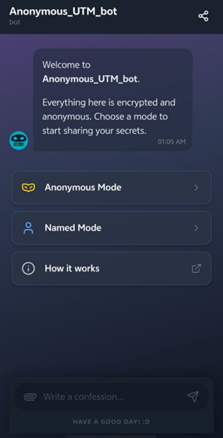

# Anonymous—UTM

**GitHub Repository:** [https://github.com/JLeongXD/Anonymous_UTM.git]

## **PROBLEM**
In many universities, students often wish to express their feelings, opinions, or personal experiences anonymously. However, there is currently no dedicated platform that allows them to do so safely and privately. Without such a system, students may struggle to share their thoughts or seek emotional support, leading to limited communication, social isolation, and unaddressed mental stress.

## **SOLUTION**
A secure and anonymous confession platform will be developed for university students. The system will allow users to submit confessions privately, where an AI model will filters inappropriate content and analyzes sentiment before publishing them to a public confession page.

## **STEP TO USE ANONYMOUS_UTM**
1. Open the link
   https://anonymous-utm-jianleong615-4001-jianleong615-4001s-projects.vercel.app?_vercel_share=xz5Hg035vIx709A7rPO3Z9euTdYTq2e7
   
